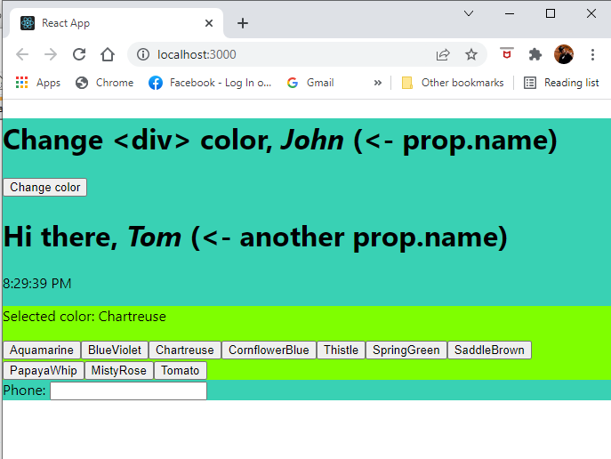

# ReactPlayground
React.js - Testing playground: States and props, component lifecycle, State Hooks

## App.js:

Testing states and props. Calling this.setState from Another Function. 
Toggles div background color with event trigger on button that calls
event handler function `changeColor()`.

```
changeColor() {
    const newColor = this.state.color === green ? yellow : green;
    this.setState({ color: newColor });
  }

<button onClick = {this.changeColor} >
```

Props from App.js to Clock,js component:
```
<Clock name="Tom"/>
...
<div><h1>Hi there,  <i>{this.props.name}</i> (&lt;- another prop.name)</h1>
```

App.js also renders all other imported components:
```
import Clock from './Clock.js';
import ColorPicker from './ColorPicker.js';
import ValidPhoneNumber from './ValidPhoneNumber.js';
...
<Clock name="Tom"/>
<ColorPicker />
<ValidPhoneNumber />
```

## Clock.js:

Testing The Component Lifecycle with class components (Mounting, Updating and Unmounting) with clock example.
Component lifecycle in this example `<Clock />` component consist following methods:

```
constructor()
render()
componentDidMount()
componentWillUnmount()
componentDidUpdate()
```
## ColorPicker.js
State Hook that uses `useState()` function. Changes the background color with `setColor()`.
```
const [color, setColor] = useState();
...
<button 
onClick={() => setColor(colorName)} 
key={colorName}>
{colorName}
</button>
```

## ValidPhoneNumber.js
State setter updates the state input only when the value from the user’s change event passes regular expression test `const validPhoneNumber = /^\d{1,10}$/;` for valid phone number strings.
```
const handleChange = ({ target })=> {
    const newPhone = target.value;
    const isValid = validPhoneNumber.test(newPhone);
    if (isValid) {
        // updates state 
        setPhone(newPhone);
    }
    // just ignore the event, when new value is invalid
  };
  ...
<input value={phone} onChange={handleChange} id='phone-input' />
```


